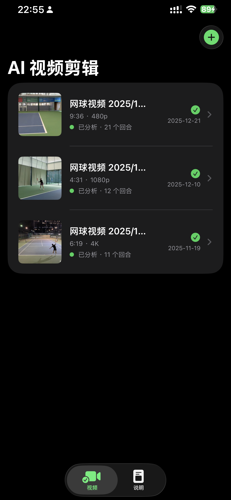
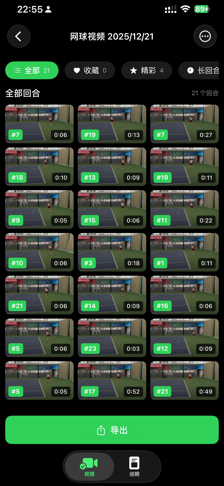
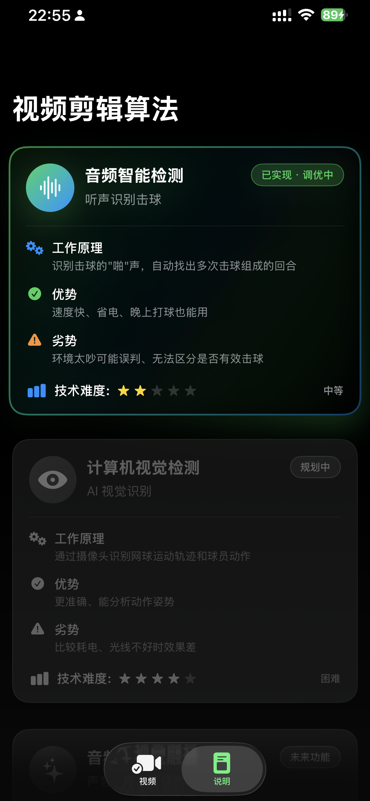
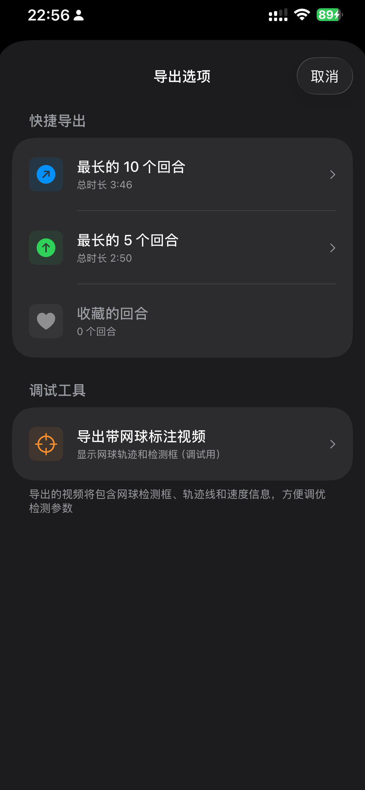

# Zacks Tennis 🎾

> AI-powered tennis video editing app / AI 智能网球视频剪辑应用

<p align="center">
  
  
  
  
</p>

## Features / 功能特性

- **AI Video Editing / AI 视频剪辑** - 自动分析网球视频，检测回合
- **Audio Detection / 音频智能检测** - 通过击球声识别回合，速度快、省电
- **Rally Management / 回合管理** - 筛选精彩回合、收藏、长回合
- **Smart Export / 智能导出** - 快捷导出最长回合、收藏回合

## Tech Stack / 技术栈

SwiftUI · SwiftData · AVFoundation · Vision · CoreML · MVVM

## Requirements / 系统要求

- iOS 17.0+
- Xcode 16.0+

## Quick Start / 快速开始

```bash
git clone https://github.com/your-username/zacks_ios_app.git
cd zacks_ios_app
open zacks_tennis.xcodeproj
# ⌘+R to run
```

## Project Structure / 项目结构

```
zacks_tennis/
├── Core/
│   ├── Models/          # Video, VideoHighlight
│   └── Services/        # VideoProcessingService, ExportManager
└── Features/
    └── VideoEditor/     # Views, ViewModels, Services
        └── Services/    # AudioAnalyzer, RallyDetectionEngine
```

## License / 许可证

[MIT](LICENSE)
